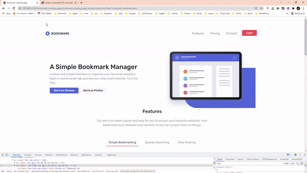
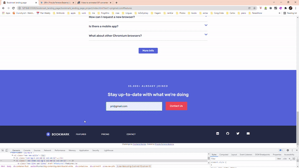

# Bookmark Landing Page Project

* create a landing page without tutorial, only search on internet document and stack Overflow.

## Project
* Bookmark [link](https://github.com/pittyh6/bookmark_landing_page/tree/master/bookmark_landing_page_project)

### Result

## Management Tools
* Jira(Sprints) [link](https://github.com/pittyh6/bookmark_landing_page/tree/master/Sprint%203)

## Tools

## What I learned
* JavaScript
* HTML
* CSS
* git / gitHub
* Jira
* javaScript Email Validation
* bootstrap is-valid / is-invalid
* Bootstrap Card/Card-box 
* Bootstrap col- lg/md/sm 
* Bootstrap Form error input
* Bootstrap
* CSS variable
* CSS background shapes
* font Awesome
* svg img
* svg img filte()
* svg img rotate()

