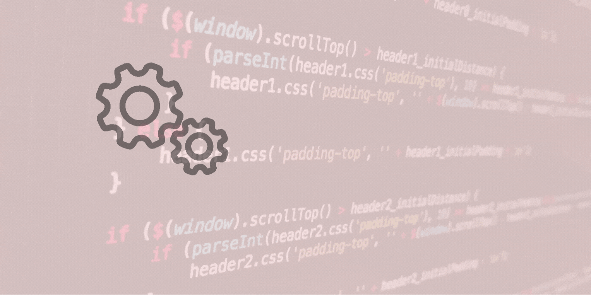

# Project Tracking Intro Component

* create a landing page without tutorial, only search on internet document and stack Overflow.

## Project
* Tracking Intro Component [link](https://github.com/pittyh6/project_tracking_intro_component)

## Management Tools
* Jira(Sprints) [link]()
### Result

## Tools

## What I learned/used
* HTML
* CSS
* JavaScript
* git / gitHub
* jira

